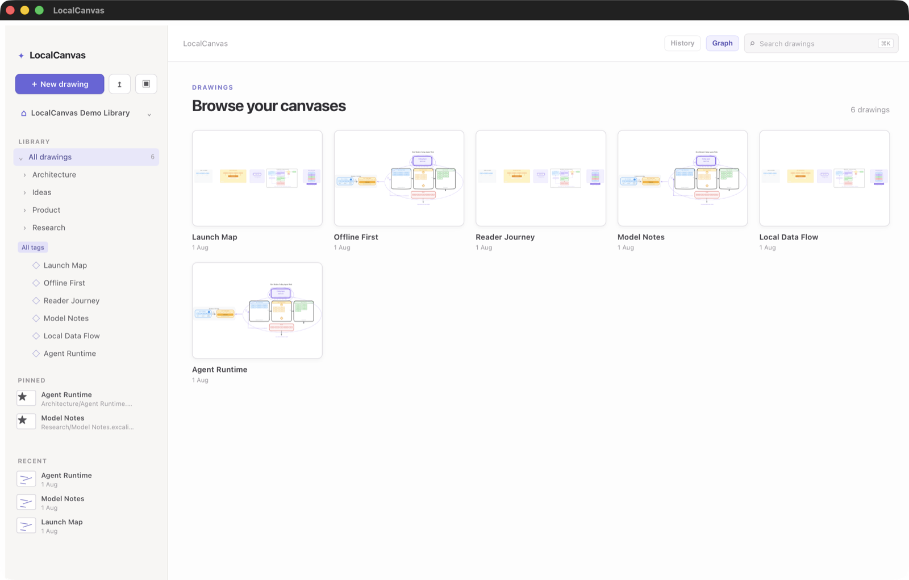
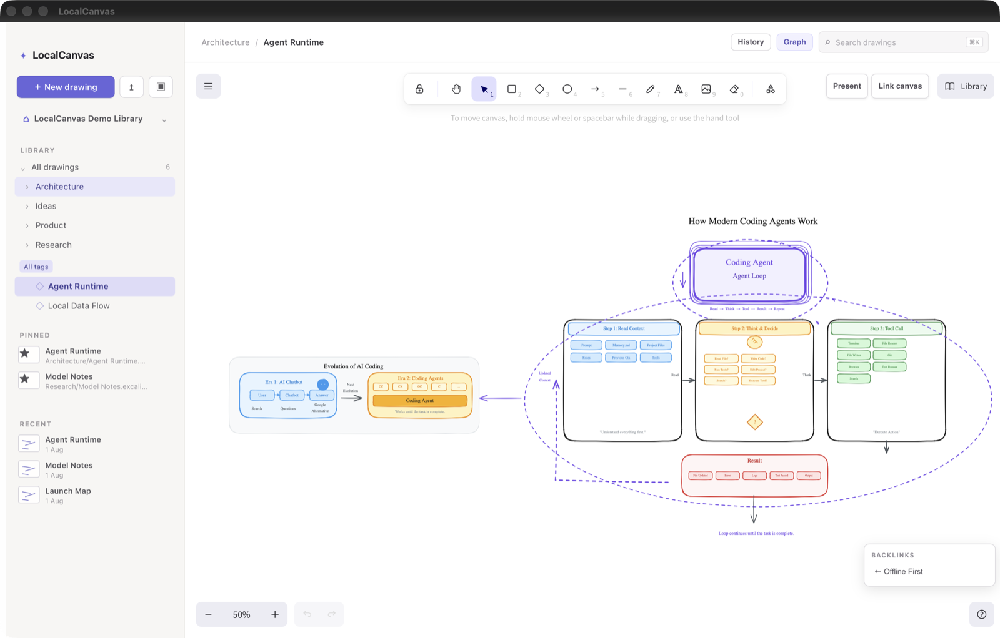
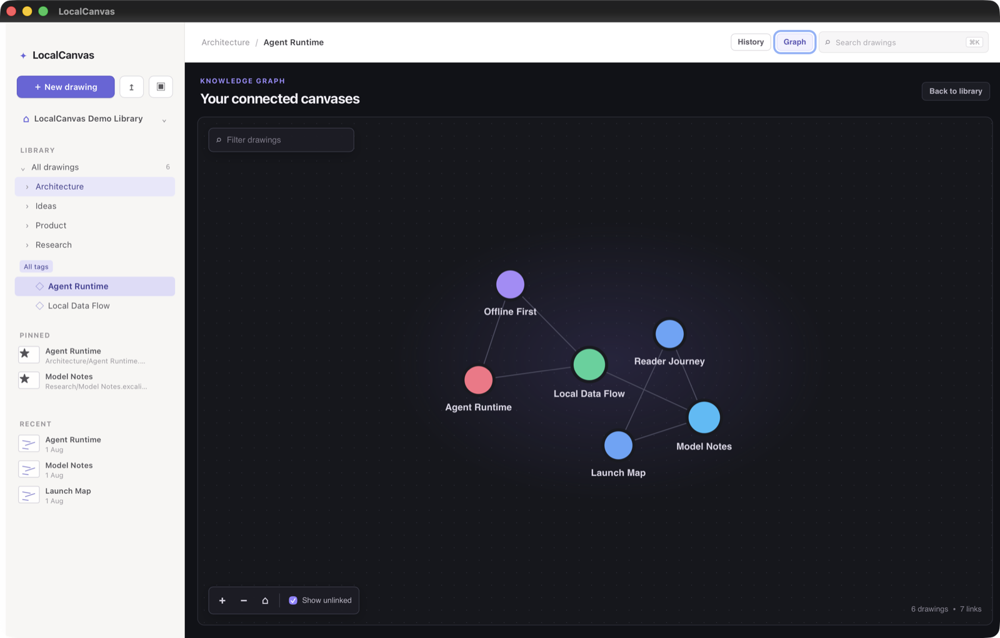

<div align="center">
  
  <h1>LocalCanvas</h1>
  <p><strong>A local-first Excalidraw workspace for macOS.</strong></p>
  <p>Organize portable canvases, connect ideas, and search everything—without an account or a cloud workspace.</p>

  <p>
    
    
    
    
    
  </p>
</div>



LocalCanvas wraps the upstream Excalidraw editor in a native-feeling desktop library. Every drawing remains a standard `.excalidraw` file in a folder you choose; LocalCanvas adds organization, search, graph navigation, history, and macOS integrations around those files.

<p align="center">
  
  
</p>

## Why LocalCanvas

- **Your files stay yours.** One portable `.excalidraw` file per canvas, stored in a library folder you control.
- **A real canvas library.** Browse nested folders, generated previews, recent files, pinned drawings, and Finder tags.
- **Search beyond filenames.** Find titles, paths, canvas text, OCR metadata, and saved voice-note transcripts from the command palette.
- **Connect your thinking.** Link canvases with portable portal metadata, follow backlinks, and navigate the resulting knowledge graph.
- **Recover confidently.** Autosaves use atomic Rust writes, while bounded local history supports preview and non-destructive restore.
- **Work offline.** Core drawing, organization, search, OCR, voice transcription, and history do not require a LocalCanvas account or hosted workspace.

## Features

### Canvas and media

- The upstream Excalidraw editor: shapes, arrows, text, freedraw, images, frames, and standard editing tools.
- Native image picker and macOS drag-and-drop support.
- Frame-based presentation mode.
- Layers panel with ordering, visibility, locking, and selection controls.
- OCR for pasted images using macOS Vision; extracted text becomes searchable metadata.
- Voice notes attached to canvas locations, with local playback and macOS on-device transcription.

### Library and navigation

- User-selected library root with nested, filesystem-backed folders.
- Create, import, rename, move, tag, pin, and delete drawings from the desktop shell.
- Cached SVG previews that regenerate when source drawings change.
- Full-text SQLite index rebuilt from the files on disk.
- `⌘K` command palette for drawings, folders, tags, graph navigation, and common actions.
- Portable canvas links, backlinks, and a force-directed graph view.
- Menu-bar quick capture.
- A `New Quick Canvas` App Shortcut for Spotlight on macOS 26 or later.

### Storage and safety

- 800 ms debounced autosave through the Rust core.
- Temporary file, `fsync`, and atomic rename instead of in-place writes.
- Local version snapshots with bounded retention and non-destructive restore.
- Filesystem watching keeps the library in sync with Finder changes.
- No direct frontend filesystem access; React communicates with Rust through typed Tauri commands.

## File format

The library folder is the source of truth:

```text
~/LocalCanvas/
├── Architecture/
│   ├── auth-flow.excalidraw
│   └── data-model.excalidraw
├── Ideas/
│   └── launch-plan.excalidraw
└── .localcanvas/
    ├── index.sqlite          # rebuildable search/graph index
    ├── thumbnails/          # rebuildable preview cache
    ├── versions/            # bounded local recovery history
    └── voice-notes/         # local audio attachments
```

LocalCanvas-specific identities, portals, OCR text, and voice-note references live in element `customData`. Upstream Excalidraw preserves this field, so the drawing remains valid in other Excalidraw-compatible tools. The SQLite index and thumbnails are caches—not the authoritative copy of a canvas.

## Build from source

> [!NOTE]
> LocalCanvas is under active development and does not currently publish a signed public release. Build it locally to try it.

### Requirements

- macOS
- Node.js and npm
- Rust toolchain
- Xcode and the macOS SDK

### Run in development

```bash
git clone https://github.com/PratikRai0101/LocalCanvas.git
cd LocalCanvas
npm ci
npm run tauri dev
```

### Build the macOS app

```bash
npm run build:macos
open src-tauri/target/release/bundle/macos/LocalCanvas.app
```

The build script creates `src-tauri/target/release/bundle/macos/LocalCanvas.app`, embeds the macOS 26 App Intents extension, and uses ad-hoc signing by default. Set `APPLE_SIGNING_IDENTITY` when preparing a properly signed distribution build.

## Architecture

```text
React library UI + upstream Excalidraw
                 │
          Tauri invoke commands
                 │
     Rust filesystem and native core
        ├── atomic scene storage
        ├── SQLite search/graph index
        ├── filesystem watcher
        ├── Finder tags and image I/O
        └── macOS Vision/Speech bridges
```

The filesystem is authoritative. Derived indexes can be rebuilt by walking the library, and LocalCanvas never requires drawing content to exist only in SQLite. See [`ARCHITECTURE.md`](ARCHITECTURE.md) and [`DECISIONS.md`](DECISIONS.md) for the detailed design and architectural decisions.

## Verify

```bash
npm run build
npm test
npm run test:compat
cargo test --manifest-path src-tauri/Cargo.toml
```

The compatibility suite exercises upstream Excalidraw import, serialization, SVG embedding, and LocalCanvas metadata round trips.

## Contributing

Issues and focused pull requests are welcome. Before changing storage, serialization, portals, or indexing, read [`AGENTS.md`](AGENTS.md), [`ARCHITECTURE.md`](ARCHITECTURE.md), and [`DECISIONS.md`](DECISIONS.md), then run the full verification suite above.
